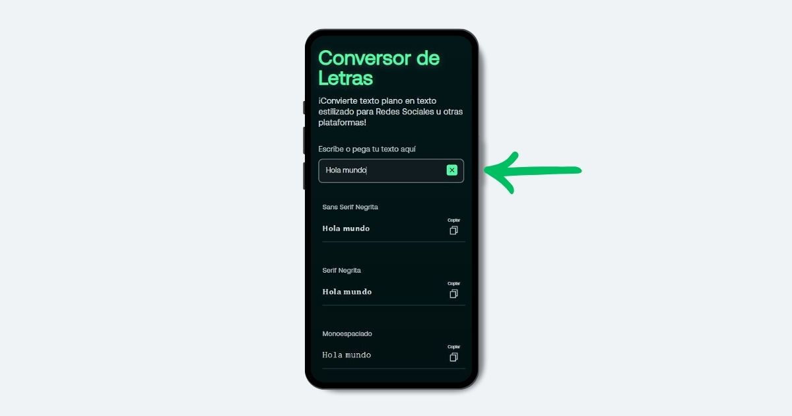

# Conversor de letras

**Conversor de letras** es una herramienta online que convierte texto plano en estilos de letras UNICODE en tiempo real. Ideal para personalizar publicaciones en redes sociales.

## Vista previa

## Características

- **Resultados en tiempo real**: Convierte texto plano en caracteres UNICODE de manera instantánea mientras se escribe.

- **Diferentes estilos de letras**: Ofrece una amplia variedad de estilos y tipografías para personalizar el texto.

- **Responsivo**: Se adapta perfectamente a cualquier dispositivo, desde computadoras hasta móviles.

## Pasos para utilizarlo

**1.** Escribe o pega tu texto en el cuadro de entrada.

**2.** Elige un estilo de letra y presiona "Copiar".

**3.** ¡Pega el texto en tu red social favorita y publica!

## Tecnologías utilizadas

- HTML
- CSS
- JavaScript

## Comprueba cómo funciona

Accede aquí → [Conversor de letras](https://conversordeletras.netlify.app/)

## Desarrollado por

**Luciano Treachi**

Soy un Desarrollador Frontend dedicado a crear soluciones web eficientes, accesibles, intuitivas y fáciles de usar que potencian la experiencia del usuario.

